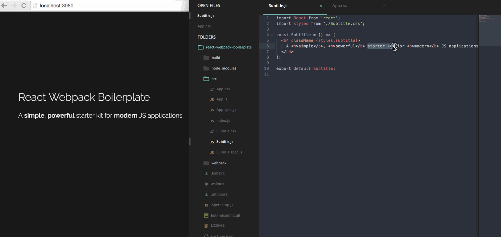

#React Webpack Boilerplate
A **simple**, **powerful** starter kit for **modern** JS web development. This was created primarily for educational purposes, but it can be used to bootstrap production-grade web Applications.

##Features
* [React](https://facebook.github.io/react/)
* [Webpack](http://webpack.github.io/docs/), for bundling
* [Hot Module Replacement](https://webpack.github.io/docs/hot-module-replacement.html), through [Webpack Dev Server](https://webpack.github.io/docs/webpack-dev-server.html) & [React Hot Loader](https://github.com/gaearon/react-hot-loader)
* [Babel](https://babeljs.io/), for ES6 and ES7 support
* [ESLint](http://eslint.org/), using Airbnb's popular [configuration](https://github.com/airbnb/javascript/tree/master/packages/eslint-config-airbnb)
* [PostCSS](http://postcss.org/) for future-proof CSS, including:
  * [PreCSS](https://github.com/jonathantneal/precss), which allows for Sass-like markup
  * [CSS Modules](https://github.com/css-modules/css-modules), so you can just name your classes intuitively
  * [Autoprefixer](https://github.com/postcss/autoprefixer), for automated cross-browser compatibility
  * [CSSNext](http://cssnext.io/), for CSS4 goodies
* [Mocha](http://mochajs.org/) and [Chai](http://chaijs.com/) unit testing, with [Enzyme](http://airbnb.io/enzyme/) testing utilities for React

##Stuff Not Included
All of the following are awesome, but they **add complexity that you don't need right away**. Check them out later, especially as your application grows larger and requires performance optimizations.
* [Server-side rendering with React](http://jamesknelson.com/universal-react-youre-doing-it-wrong/)
* [React Router](https://github.com/reactjs/react-router)
* [Redux](http://redux.js.org/)
* [Immutable.js](https://facebook.github.io/immutable-js/)

##Prerequisites
[Node.js](https://nodejs.org) v6+

##Usage
###Installation
```sh
git clone https://github.com/jackrzhang/react-webpack-boilerplate.git
cd react-webpack-boilerplate
rm -rf .git
git init
rm hot-reloading.gif
npm install
```

###Development
```sh
npm run clean
npm start
open http://localhost:8080
```

###Production
```sh
npm run build
open build/index.html
```

###Linting
```sh
npm run lint
```

###Testing
```sh
npm run test
```

###Hot Reloading Demo


##License
[MIT](https://github.com/jackrzhang/react-webpack-boilerplate/blob/master/LICENSE)
